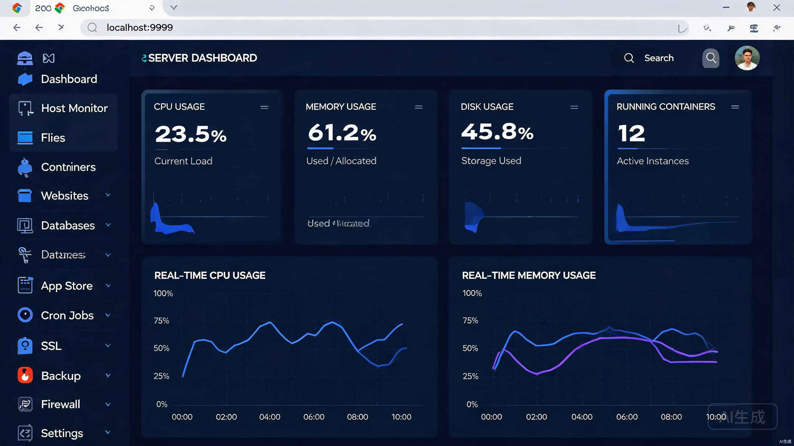
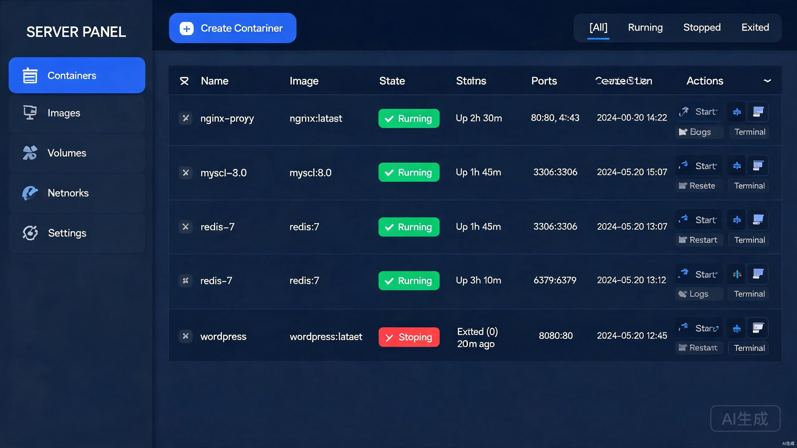
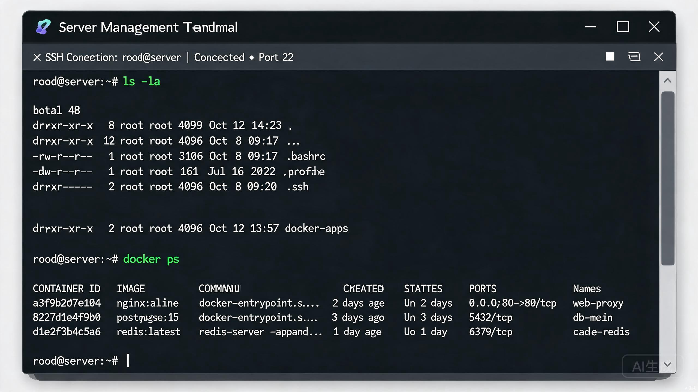

<div align="center">



<h1>openforge-maintain</h1>

<p>
  <strong>Modern, Open-Source Linux Server Operations Management Platform</strong>
</p>

<p>
  A single-binary, low-intrusion web panel for managing Linux servers via browser.<br/>
  No more SSH — monitor, deploy, and maintain everything from one place.
</p>

<p>
  <a href="https://github.com/openforge-teams/openforge-maintain/releases">
    
  </a>
  <a href="https://go.dev/">
    
  </a>
  <a href="https://vuejs.org/">
    
  </a>
  <a href="https://www.typescriptlang.org/">
    
  </a>
  <a href="https://www.docker.com/">
    
  </a>
  <a href="https://opensource.org/licenses/MIT">
    
  </a>
</p>

<p>
  <a href="#features">Features</a> •
  <a href="#architecture">Architecture</a> •
  <a href="#quick-start">Quick Start</a> •
  <a href="#tech-stack">Tech Stack</a> •
  <a href="#roadmap">Roadmap</a> •
  <a href="#contributing">Contributing</a>
</p>

</div>

---

## Features

### 🖥️ Host Monitoring
Real-time monitoring of CPU, memory, disk, network, and processes with WebSocket-powered live metrics streaming and ECharts visualizations.

### 📁 File Management
Browse, upload (chunked), download, edit (Monaco Editor), compress/decompress, and manage file permissions — all from your browser.

### 🐳 Container Management
Full Docker lifecycle management — containers, images, volumes, networks, and Docker Compose orchestration. Exec into containers via the integrated web terminal.

### 🌐 Website Management
Create and manage Nginx-based websites — static sites, reverse proxies, PHP applications — with one-click SSL certificate provisioning (Let's Encrypt, ZeroSSL, and 25+ DNS providers).

### 🗄️ Database Management
Containerized database management for MySQL/MariaDB, PostgreSQL, and Redis — backup, restore, user management, and configuration.

### 🏪 Application Store
20+ built-in applications (WordPress, Halo, MySQL, Redis, PostgreSQL, Nginx, n8n, Ollama, MinIO, Gitea, Nextcloud, and more) deployed via parameterized Docker Compose templates.

### ⏰ Cron Jobs
Schedule and manage recurring tasks with cron expression support — shell commands, scripts, HTTP callbacks, and backup triggers.

### 🔒 Security
Six-layer defense model: JWT + bcrypt authentication, MFA (TOTP), security entry (random URL path), IP whitelist, rate limiting, Fail2ban integration, and full audit logging.

### 💾 Backup & Restore
Flexible backup strategies — local disk, AWS S3, Alibaba Cloud OSS, MinIO, SFTP — for individual applications, websites, databases, or full system snapshots.

### 🛡️ Firewall
Unified firewall management wrapping ufw/iptables/firewalld with port rules, IP blocking, and Fail2ban auto-ban for brute-force protection.

### 💻 Web Terminal
Full-featured browser-based terminal powered by xterm.js with WebSocket transport — no SSH client required.

---

## Architecture

openforge-maintain adopts a **Core/Agent separated dual-service architecture**, even in single-node deployment, preparing for future multi-node management.

```
┌──────────────────────────────────────────────────┐
│              Browser (Vue 3 SPA)                 │
│   /api/v2/core/*  →  Core Service                │
│   /api/v2/*        →  Agent Service               │
└──────────────┬──────────────────┬─────────────────┘
               │                  │
               ▼                  ▼
        ┌──────────────┐  ┌──────────────────┐
        │  Core :9999  │  │  Agent :10000     │
        │  Auth / User │  │  Docker / Files   │
        │  Nodes / RBAC│  │  Websites / DBs   │
        │  Audit Log   │  │  AppStore / SSL   │
        │  core.db     │  │  Cron / Backup    │
        └──────────────┘  │  Firewall / AI    │
                          │  agent.db         │
                          └──────┬───────────┘
                                 │
                   ┌─────────────┼──────────────┐
                   ▼             ▼              ▼
              Docker Engine   systemd     Nginx / Host
```

**Four-layer internal architecture** per service:

```
Router (routes + middleware)
    ↓
Handler (param validation + response formatting)
    ↓
Service (business logic orchestration)
    ↓
Repository (data access, interface-driven)
```

---

## UI Preview

<table>
  <tr>
    <td></td>
    <td></td>
  </tr>
  <tr>
    <td align="center">Dashboard — Real-time System Monitoring</td>
    <td align="center">Container Management — Lifecycle Operations</td>
  </tr>
  <tr>
    <td colspan="2" align="center"></td>
  </tr>
  <tr>
    <td colspan="2" align="center">Web Terminal — Browser-based Shell Access</td>
  </tr>
</table>

---

## Quick Start

### One-Click Install (Recommended)

```bash
curl -sSL https://raw.githubusercontent.com/openforge-teams/openforge-maintain/main/deploy/install.sh | bash
```

### Docker Deploy

```bash
docker compose up -d
```

### Manual Build

**Prerequisites:** Go 1.22+, Node.js 20+

```bash
# Clone the repository
git clone https://github.com/openforge-teams/openforge-maintain.git
cd openforge-maintain

# Build backend (static binary, no CGO required)
make build

# Build frontend
cd frontend && npm install && npm run build

# Start services
./bin/core &
./bin/agent &
```

After installation, access the panel at:

```
http://<your-server-ip>:9999/<security-entry>/
```

> The security entry is a random path suffix generated during installation.
> Retrieve it via SSH: `cat /opt/openforge-maintain/data/security_entry`

**Default credentials:** `admin` / `maintain@2024` — change immediately after first login.

---

## Tech Stack

| Layer | Technology | Rationale |
|-------|-----------|-----------|
| **Backend Language** | Go 1.22+ | Single binary, CGO-free, high concurrency |
| **Web Framework** | Gin | Production-proven, ecosystem-rich |
| **ORM** | Gorm + glebarez/sqlite | Pure Go SQLite driver, zero config |
| **Database** | SQLite | Zero-config, single-file backup |
| **Frontend** | Vue 3 + TypeScript + Vite | Modern reactive SPA |
| **UI Library** | Ant Design Vue 4 | Enterprise-grade component library |
| **State Management** | Pinia | Official Vue store |
| **Charts** | ECharts | Real-time monitoring visualizations |
| **Terminal** | xterm.js + WebSocket | Browser-based shell |
| **Editor** | Monaco Editor | In-browser code editing |
| **Container Runtime** | Docker Engine | Industry standard |
| **SSL/ACME** | go-acme/lego | Auto certificate provisioning |
| **Auth** | JWT + bcrypt + TOTP | Secure multi-factor authentication |
| **RBAC** | Casbin | Policy-driven access control |
| **i18n** | vue-i18n | Chinese / English bilingual |
| **Deployment** | systemd + single binary | Panel crash won't affect running services |

---

## Project Structure

```
openforge-maintain/
├── cmd/
│   ├── core/main.go              # Core service entry
│   └── agent/main.go             # Agent service entry
├── core/                          # Core service (auth, users, nodes, audit)
│   ├── router/
│   ├── handler/
│   ├── service/
│   ├── repository/
│   ├── model/
│   └── middleware/
├── agent/                         # Agent service (all operations)
│   ├── service/
│   │   ├── docker/               # Container / Image / Volume / Network / Compose
│   │   ├── file/                 # File management
│   │   ├── website/              # Nginx / websites
│   │   ├── database/             # MySQL / PostgreSQL / Redis
│   │   ├── system/               # System metrics collector
│   │   ├── cron/                 # Scheduled tasks
│   │   ├── appstore/             # Application store + registry
│   │   ├── ssl/                  # ACME certificate management
│   │   ├── backup/               # Backup & restore
│   │   ├── firewall/             # Firewall rules
│   │   └── ai/                   # AI model management (upcoming)
│   ├── handler/
│   ├── repository/
│   ├── router/
│   └── model/
├── frontend/                      # Vue 3 SPA
│   └── src/
│       ├── api/                   # Axios API modules
│       ├── views/                 # Page components (20+ views)
│       ├── layout/               # Main layout + sidebar + header
│       ├── store/                 # Pinia stores
│       ├── i18n/                 # Internationalization
│       └── utils/                 # Utilities
├── pkg/                           # Shared libraries
│   ├── utils/                    # JWT, bcrypt, response, path safety
│   ├── response/                 # Unified API response format
│   └── system/                   # System metrics collector
├── deploy/
│   ├── install.sh                # One-click install script
│   └── systemd/                  # systemd unit files
├── Dockerfile                     # Multi-stage Docker build
├── docker-compose.yaml            # Docker Compose deployment
└── Makefile                       # Build automation
```

---

## Roadmap

- [x] **Phase 1 — MVP** — Project skeleton, JWT auth, host monitoring, file management, container lifecycle, web terminal
- [x] **Phase 2 — Websites & Databases** — Nginx integration, SSL automation, MySQL/PostgreSQL/Redis management, cron jobs
- [x] **Phase 3 — App Store & Backup** — 20+ built-in apps, local/S3/OSS/SFTP backup, firewall + Fail2ban, audit logging
- [ ] **Phase 4 — Enterprise** — Multi-node Core/Agent, Casbin RBAC, MFA/Passkey, Ollama AI integration, GPU monitoring
- [ ] **Phase 5 — Ecosystem** — Plugin system, community app contributions, security audit, Kylin/UOS domestic OS support

---

## Design Philosophy

| Principle | Implementation |
|-----------|---------------|
| **Low Intrusion** | Panel runs as a separate systemd service — stopping it never affects deployed applications |
| **Container-First** | Every application in the store runs as a standard Docker Compose stack |
| **Six-Layer Security** | Authentication → Network → Application → Data → Audit → License |
| **Zero Runtime Dependency** | Static Go binary (CGO_ENABLED=0), SQLite embedded — deploy with a single file |
| **Extensible Architecture** | Core/Agent separation enables future multi-node management |
| **Repository Pattern** | Services depend on interfaces, not concrete implementations — testable and swappable |

---

## Supported Platforms

| OS | Architecture |
|----|-------------|
| Ubuntu 20.04/22.04/24.04 | x86_64, ARM64 |
| Debian 11/12 | x86_64, ARM64 |
| CentOS 7/8/9 | x86_64 |
| AlmaLinux 9 | x86_64 |
| Rocky Linux 9 | x86_64 |
| Kylin / UOS | x86_64, ARM64 *(upcoming)* |

---

## Contributing

Contributions are welcome! Please follow these steps:

1. Fork the repository
2. Create a feature branch (`git checkout -b feature/your-feature`)
3. Commit your changes (`git commit -m 'Add your feature'`)
4. Push to the branch (`git push origin feature/your-feature`)
5. Open a Pull Request

---

## License

This project is licensed under the MIT License — see the [LICENSE](LICENSE) file for details.

---

<div align="center">

**Built with ❤️ by [OpenForge Teams](https://github.com/openforge-teams)**

</div>
